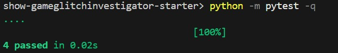

# 🎮 Game Glitch Investigator: The Impossible Guesser

## 🚨 The Situation

You asked an AI to build a simple "Number Guessing Game" using Streamlit.
It wrote the code, ran away, and now the game is unplayable. 

- You can't win.
- The hints lie to you.
- The secret number seems to have commitment issues.

## 🛠️ Setup

1. Install dependencies: `pip install -r requirements.txt`
2. Run the broken app: `python -m streamlit run app.py`

## 🕵️‍♂️ Your Mission

1. **Play the game.** Open the "Developer Debug Info" tab in the app to see the secret number. Try to win.
2. **Find the State Bug.** Why does the secret number change every time you click "Submit"? Ask ChatGPT: *"How do I keep a variable from resetting in Streamlit when I click a button?"*
3. **Fix the Logic.** The hints ("Higher/Lower") are wrong. Fix them.
4. **Refactor & Test.** - Move the logic into `logic_utils.py`.
   - Run `pytest` in your terminal.
   - Keep fixing until all tests pass!

## 📝 Document Your Experience

This game is a number guessing challenge where the player attempts to guess a secret number in a limited number of tries. The app includes difficulty levels, an attempt limit, and a score system.

Bugs found and fixed:
- Direction hints were backwards (the text said "Go HIGHER" when the guess was too high).
- Attempt initialization started at 1, causing off-by-one game-over behavior.
- New game reset did not fully reset `status`, `history`, and score.

Fixes applied:
- Moved core game logic into `logic_utils.py` and imported helper functions in `app.py`.
- Corrected `check_guess` output logic and messages.
- Used `st.session_state` for persistent secret/attempts/status and reset properly.
- Added regression tests in `tests/test_game_logic.py`.

## 📸 Demo

The game now supports winning, correct hint messages, and proper reset behavior. Tests pass (4/4) with:

```bash
python -m pytest -q
```



## 🚀 Stretch Features

- Completed core bug fixes and validation. No stretch screenshot added yet.

